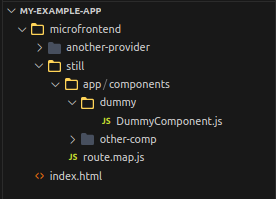
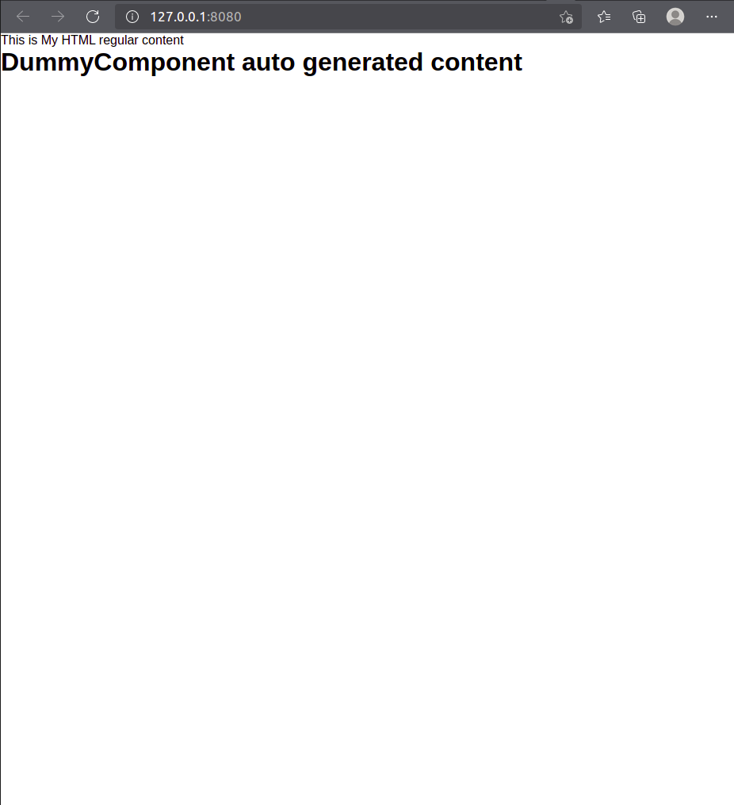
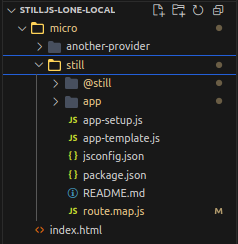

### Overview
The <b>Lone Component</b>, also known as <b>CDN-based project</b>, allows embedding Still.js components into other web applications without relying on the Still Application container. When done via CDN it must follow a minimal project structure having the <b>`app/`</b> folder for components and the <b>`route.map.js`</b> file for routing configuration.

Although in many cases it might be used through the CDN, it's still recommended to use still-cli for basics setup and component creation since this is an automatical way to create components and handle the routing.
<br><br>
#### Microfrontend
Lone component also provides with the capabilities to build a whole Frontend tied to an entrypoint component thereby making it possible to scale it to Microfrontend.

<br>
<a name="making-component-private"></a>
### 1. Basic Lone component application tutorial

<a name="point.1.1"></a>

#### - Simple project folder structure


The bellow folder structure is only an example which can also be taken as suggestion, anyway the most important files are the <b>`app/`</b> folder and <b>`route.map.js`</b> file.


```python
    project-name #My project root folder
    |___ microfrontend/ #This is a folder where all microfrontends will be placed
    |     |__ still/ #This folder contanins the microfrontends implementations in Still.js
    |     |    |__ app/ #App folder where component will be placed
    |     |    |    |__ components/ #Folder which holds the comopnents
    |     |    |    |    |__ dummy/ #Folder which holds the comopnents
    |     |    |    |    |    |__ DummyComponent.js #Created in the point 1.4
    |     |    |    |    |__ another/ #Will house components concerning to the user
    |     |    |__ route.map.js #still-cli will add the route automatically when creating a component
    |     | 
    #Bellow are the files of my project placed in the project root folder
    |__ index.html
    |__ my-project-folder/
    |__ ... #Additional files from my project

```

##### Code editor/IDE view:


<br><br>

#### 1.1 Setup - Generating base files (app/, route.map.js) for Lone components to work

From inside the folder where we want to have our Lone components, using the still-cli we have to run the following:

```
npx still lone
```

<br>

#### 1.2 Adding the CDN and embeding the component to the HTML file

<b>index.html</b> file is being used in this case, but it can just be done in any  type of file that will render something to the browser.

=== "index.html"

```html linenums="1" hl_lines="10 12-13 20"
<!DOCTYPE html>
<html lang="en">

<head>
    <meta charset="UTF-8">
    <meta http-equiv="X-UA-Compatible" content="IE=Edge">
    <meta content="width=device-width, initial-scale=1" name="viewport" />
    <title>StillJS</title>
    <!-- Bellow (STILL_HOME) is the Still env variable to inform where to look for components -->
    <script> STILL_HOME = 'microfrontend/still/' </script>
    <!-- Bellow both JavaScript and CSS CDN inclusion, JS type neeeds to module -->
    <link href="https://cdn.jsdelivr.net/npm/@stilljs/core@latest/@still/ui/css/still.css" rel="stylesheet">
    <script src="https://cdn.jsdelivr.net/npm/@stilljs/core@latest/@still/lone.js" type="module"></script>
</head>

<body>
    <div>
        This is My HTML regular content nothing to do with Still.js
        <!-- Bellow component (DummyComponent) will be created step (step 1.4) -->
        <st-element component="DummyComponent"></st-element>
    </div>
</body>
```

Our application file is required to set the <b>`STILL_HOME`</b> variable which needs to point to the root folder where the still project is located, as this is how the framework knows how to bring components to our application.

<br>

<a name="running-lone-cmp"></a>
#### 1.3 Running my Application
In order for the components to load properly the Application needs to be served from a web server, it can be NGINX or Apache for example, in this case, we'll use live-server. Using live-server we need to do it from the root folder:


??? success "Expand to show Lone component running success"
    


<br>

#### 1.4 Creating the Lone component Whithin CDN base project

Let's create our Lone component based on the folder structure presented previously (<a href="#point.1.1">point 1.1</a>), from the root folder where still is located and use <b>abbreviated still-cli command option</b>.


When creating a Lone component in the CDN context, we need to pass the <b>`--lone`</b> at the end, as this is how still understands that the whole structure and files are not present locally.

Once generated, the component should have the scaffolding code as follows:  

=== "DummyComponent.js"

    ```js title="" linenums="1"
    export class DummyComponent extends ViewComponent {

        isPublic = true;
        template = `
            <h1 class="still-fresh-generated-cmp">
                DummyComponent  auto generated content
            </h1>
        `;

        constructor(){
            super();
        }

    }
    ```
In this case the <b>`ViewComponent`</b> super class is not imported dispite being extended, this is because CDN provides it since it is not present locally.


<br><br>

### 2. Lone component by having whole framework Structure locally

#### Context
Lone component can also be created in the scenario where I have create a regular Still.js project, however for a specific situation I need a component which can be embeded to my other type (not Still.js) of Application.

#### User case
This could be a good use case where I have more than one application or where some of the resources would be shared between my Lone component and another Still.js Application I have.

<br>

#### 2.1 Folder Structure




The big different between this approach vs using CDN approach is that we have the whole Still.js folder structure and files locally, but how HTML/main application file(s) will always stay outside since Still.js components will only be embeded but not dictate the application flow itself.

The HTML/Application file in this case will point to the local files instead of the CDN ones, follow the code sample:

<br>

#### 1.3 Adding the CDN and embeding the component to the HTML file

=== "index.html"

```html linenums="1" hl_lines="10 12-13 22"
<!DOCTYPE html>
<html lang="en">

<head>
    <meta charset="UTF-8">
    <meta http-equiv="X-UA-Compatible" content="IE=Edge">
    <meta content="width=device-width, initial-scale=1" name="viewport" />
    <title>StillJS</title>
    <!-- Bellow (STILL_HOME) is the Still env variable to inform where to look for components -->
    <script> STILL_HOME = 'micro/still/' </script>
    <!-- Since the Still.js files are present locally we point to it instead of the CDN -->
    <link href="micro/still/@still/ui/css/still.css" rel="stylesheet">
    <script src="micro/still/@still/lone.js" type="module"></script>
</head>

<body>

    <div>
        This is a regular HTML page, let's test the Lone component
        feature in Still.js and
        <!-- Bellow component (DummyComponent) need to be created as in the point (1.2) -->
        <st-element component="DummyComponent"></st-element>
    </div>

</body>
```

!!! warning "Component creation consideration"
    Unlike the CDN scenario, we don't have to use the <b>`--lone`</b> option when creating Lone component having the whole Still.js folder structure and files.

Once the Still.js setup is done for our application, we then need to run it, in this case the process will be the same as point <a href="#running-lone-cmp">1.5</a>.

<br>

!!! info "Microfrontend considerations"
    Although Lone Components don't run within the Still.js Application container, they still support all core framework features — like <b>reactivity</b>, <b>services</b>, <b>routing</b>, <b>authorization</b>, etc. — making them suitable for a Microfrontend architecture.